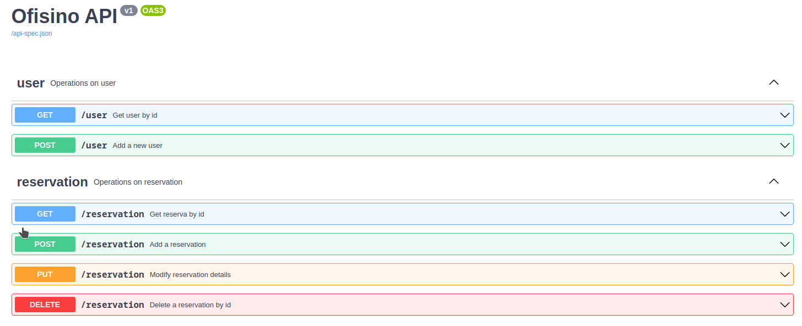

# Ofisino

Ofisino te ayuda a reservar tu lugar en la oficina y a coordinar tus reuniones de manera inteligente


## Organización
El repositorio está organizado en una carpeta de backend y una carpeta de frontend.
Cada carpeta tiene un archivo `README.md` con las instrucciones para levantar la aplicación.

## Iniciar app
```shell

cp backend/.env.sample backend/.env
docker compose up
```
Una vez levantada la app, la documentación de la api está accesible en 3 lugares distintos,
para que elijas la ui que más me guste para explorar los distintos endpoints
- `http://localhost:8000/swagger`
- `http://localhost:8000/redoc`
- `http://localhost:8000/rapidoc`



## Features
- Reservar tu lugar en el espacio de trabajo
- Administrar tu espacio de trabajo, con máxima cantidad de trabajadores
- Coordinar reuniones de forma asistida, buscando un horario óptimo

## Tech Stack

### Backend
- [Python](https://www.python.org/)

### Frontend
- [React](https://es.reactjs.org/)

### Persistence
- [Postgres](https://www.postgresql.org/)

### Deploy
- [Digital Ocean](https://www.digitalocean.com/)

## Diagrama de arquitectura


